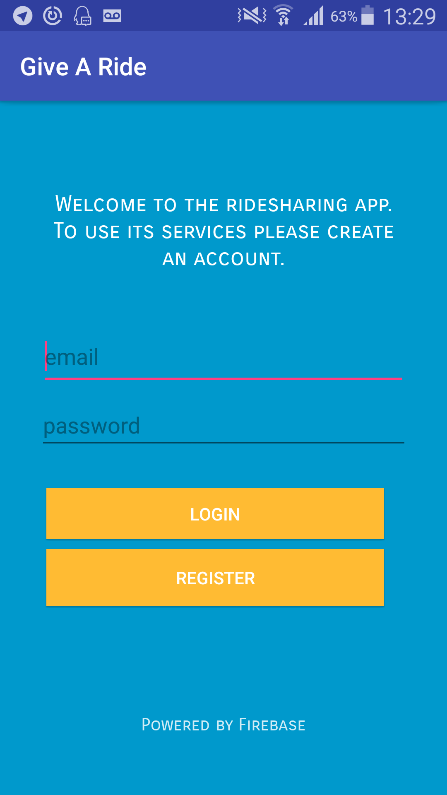
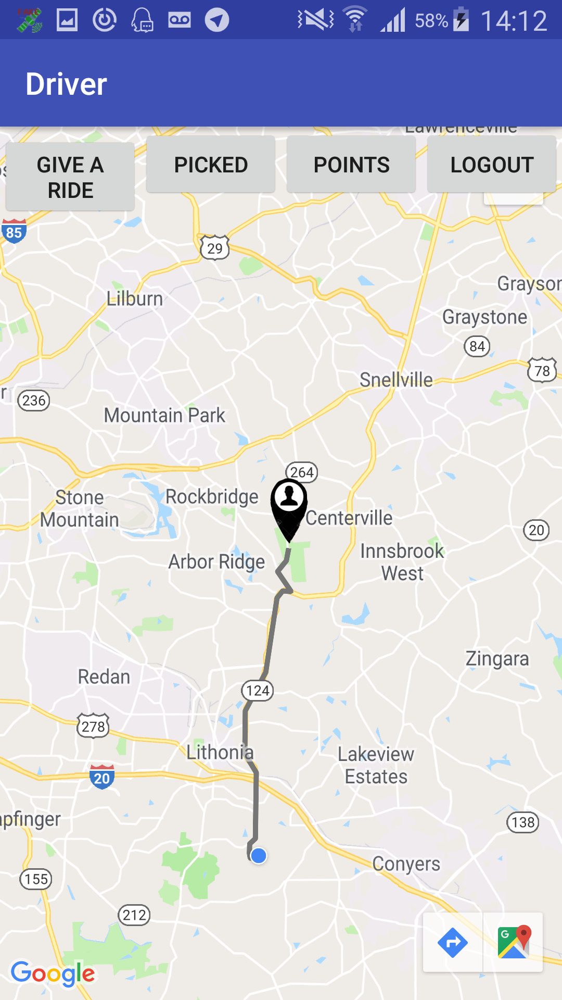
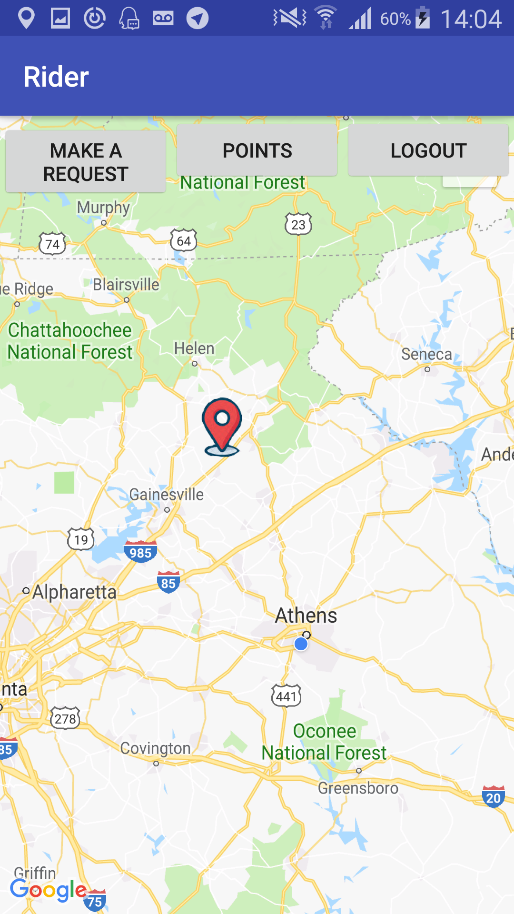

<h1> Give A Ride </h1>

 App is made for users to make a riding request. A driver can find the nearest request and decide if he/she wants to give a ride. The route is painted using package of jd-alexender. 10 points will be earned by driver and given from the rider. 

